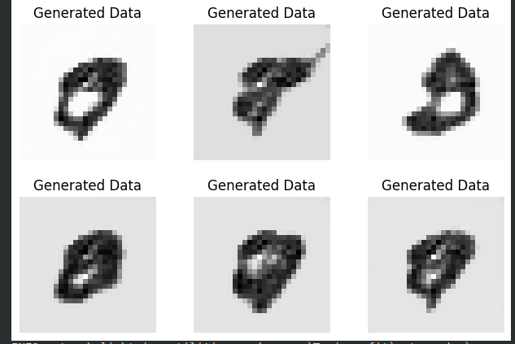

# GAN vs. WGAN for MNIST Digit Generation

This repository contains the implementation of a standard **Generative Adversarial Network (GAN)** and a **Wasserstein GAN (WGAN)** to generate handwritten digits from the MNIST dataset. The code is built using **PyTorch** and **PyTorch Lightning**.

---

## Project Overview

The goal of this project is to explore and compare the performance of two different GAN architectures in generating realistic images. We use the well-known MNIST dataset of handwritten digits as a benchmark.

The key difference lies in the **loss function** and the **training stability**, with WGANs designed to address instability issues inherent in standard GANs.

---

## Code Structure

- `gans.py`: Implements the standard GAN model.
- `wgans.py`: Implements the Wasserstein GAN with Gradient Penalty (WGAN-GP).
- `gan.png`: A sample of images generated by the standard GAN after 40 epochs.
- `wgan.png`: A sample of images generated by the WGAN after 40 epochs.

---

## Models

Both implementations share a similar **generator** and **discriminator/critic** architecture but differ significantly in their **training dynamics** and **loss functions**.

### Generator

The generator network takes a 100-dimensional latent vector (random noise) as input and upsamples it to produce a 28x28 grayscale image.

- **Input:** A latent vector of shape `[batch_size, 100]`
- **Architecture:**
  - A fully connected layer that projects the latent vector to a 7x7x64 tensor
  - Two transposed convolutional layers to upsample the tensor to 34x34x16
  - A final convolutional layer to produce the output image of shape `[batch_size, 1, 28, 28]`
- **Activation Functions:** ReLU is used in the intermediate layers

### Discriminator / Critic

The Discriminator (or Critic in WGAN) is a **Convolutional Neural Network (CNN)** designed to classify images as real or fake.

- **Input:** A 28x28 image
- **Architecture:**
  - Two convolutional layers with max-pooling and dropout
  - Two fully connected layers that output a single logit

#### Key Differences:

- **Standard GAN:** Final output is passed through a sigmoid function to produce a probability between 0 and 1
- **WGAN:** Final sigmoid layer is removed, allowing the critic to output a raw score (real number), which is essential for the Wasserstein loss

---

## Key Differences in Implementation

### 1. Standard GAN (`gans.py`)

- **Loss Function:** Binary Cross-Entropy (`F.binary_cross_entropy`)
  - **Discriminator Loss:** `max(log(D(x)) + log(1 - D(G(z))))`
  - **Generator Loss:** `max(log(D(G(z))))`
- **Optimization:** Two separate optimizers for the generator and discriminator using manual optimization in PyTorch Lightning

### 2. Wasserstein GAN (`wgans.py`)

- **Loss Function:** Wasserstein Loss
  - **Critic Loss:** `E[D(x)] - E[D(G(z))]`
  - **Generator Loss:** `-E[D(G(z))]`
- **Gradient Penalty:** Enforces the 1-Lipschitz constraint using gradient penalty instead of weight clipping
- **Training Ratio:** The critic is trained more frequently than the generator (5 critic updates per generator update)

---

## Results

Below are the images generated by both models after 40 epochs of training.

### GAN-Generated Images

The standard GAN produces recognizable digit-like forms, but some results show instability and less defined shapes.

---

### WGAN-Generated Images

The WGAN generally produces more stable and higher-quality images. The digits are often more clearly defined compared to the standard GAN.

